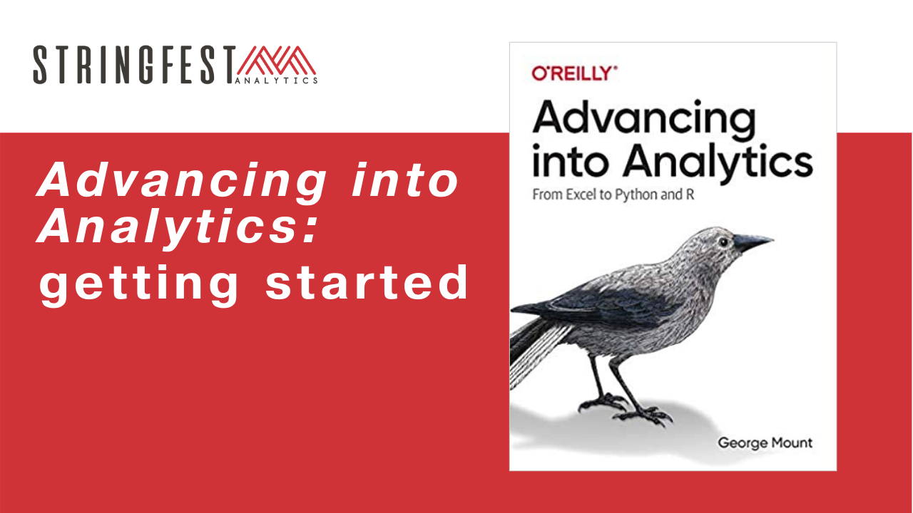

# _Advancing into Analytics_: getting started

By the end of this workshop, you will have a **complete working environment** with Excel, R and Python on your computer to conduct summary statistics and more. 

## It is recommended to attend this workshop on a Windows machine.

##### Follow along with each section by using the demo notes, also available in this repo. 

### [Learn more about *Advancing into Analytics*, including how to read for free, here](http://stringfestanalytics.com/book/)
